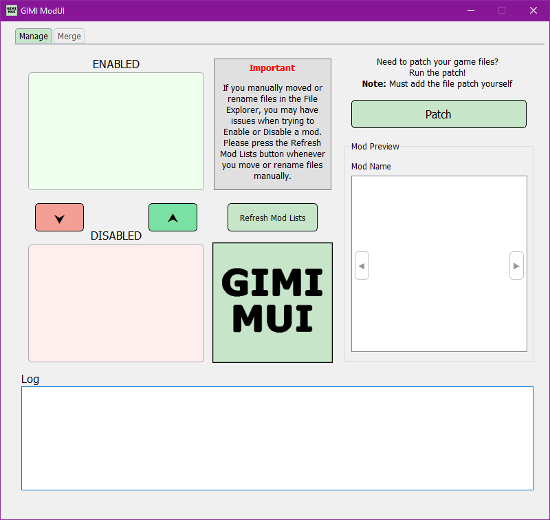
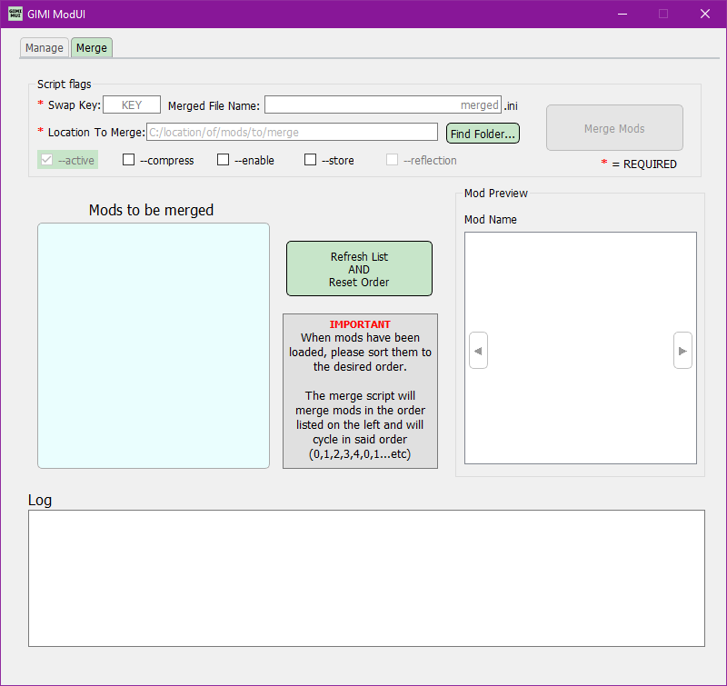

# GIMI-MUI

A simple mod manager that also allows you to easily use SilentNightSound's existing [<i>GI-Model-Importer</i>](https://github.com/SilentNightSound/GI-Model-Importer). Be sure to support them for their amazing work! 

I independently created this application in order to piggyback on the existing file structure of <i>GI-Model-Importer</i> to:
- Easily enable/disable mods
- More easily use the merge script provided by SilentNightSound
- More easily patch your files

<b>Note:</b> If you use .py files for manage/merge, be sure to have python installed on your system.

# Logo / Icon
I couldnt think of a nice logo, so I decided to let users pick what logo the application should have. By default, it will be the provided logo, but you can swap in any `.png` or `.jpg` file in place of the existing `LogoImg.png`. Just make sure to rename it "`LogoImg`"

# File Structure
`GIMI-MUI.exe` and `main.ui` must be on the same level in order for the app to function. In order to run a patch or merge script, you must place the files in the appropriate location. 
```bash
.
├── GIMI-MUI.exe
├── LogoImg.png
├── Mods
├── Scripts
│   ├── Merge
│   │   └── your_merge_script.txt
│   └── your_patch_script.txt
└── main.ui
```

# How to use with <i>GI-Model-Importer</i>
The files add to `<i>GI-Model-Importer</i>` and require nothing more than a simple drag-and-drop into the 3dmigoto folder. In order to use this app with <i>GI-Model-Importer</i>, simplay place the above listed files/folders in the same folder as `3DMigoto Loader.exe`.

Simplified file structure:
```bash
.
├── 3DMigoto Loader.exe
│
├── GIMI-MUI.exe
├── LogoImg.png
├── Scripts
└── main.ui
```

# Screenshots



